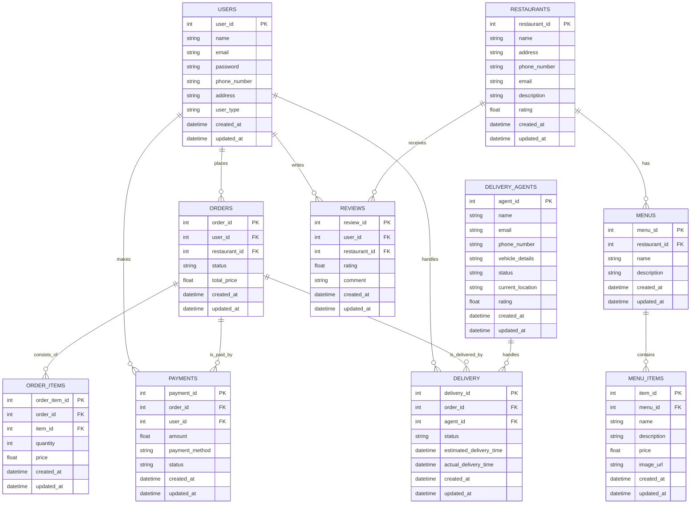

# Food Delivery API App System Design

## Food Delivery API App

Let's design a Food API App like Swiggy/Zomato

## What is Food Delivery APIs?

### Overview
The food delivery app is designed to facilitate seamless ordering and delivery of food from various restaurants to customers. The app will have three primary user roles: customers, restaurants, and delivery personnel. Each role will have its own set of functionalities, accessed through a user-friendly interface on both mobile and web platforms.

### Features

#### For Customers:
1. **User Registration and Authentication**: Customers can register, log in, and manage their profile.
2. **Restaurant Browsing and Search**: Customers can browse and search for restaurants based on location, cuisine, ratings, etc.
3. **Menu Viewing**: Detailed menus for each restaurant with item descriptions, prices, and availability.
4. **Order Placement**: Customers can place orders, customize items, and add special instructions.
5. **Order Tracking**: Real-time tracking of order status, from preparation to delivery.
6. **Payment Gateway Integration**: Multiple payment options, including credit/debit cards, digital wallets, and cash on delivery.
7. **Rating and Reviews**: Customers can rate and review restaurants and delivery personnel.
8. **Order History**: View past orders and reorder favorite items.

#### For Restaurants:
1. **Restaurant Registration and Authentication**: Restaurants can register, log in, and manage their profile and menu.
2. **Menu Management**: Add, edit, or remove items from the menu.
3. **Order Management**: Receive and manage incoming orders, update order status, and communicate with customers.
4. **Analytics and Reporting**: Access to sales reports, customer feedback, and other analytics.
5. **Promotions and Discounts**: Create and manage promotional offers and discounts.

#### For Delivery Personnel:
1. **Delivery Personnel Registration and Authentication**: Delivery personnel can register, log in, and manage their profile.
2. **Order Management**: View and accept delivery assignments, update delivery status, and navigate to the delivery location.
3. **Earnings and Payments**: Track earnings and request payments.
4. **Ratings and Reviews**: View ratings and reviews from customers.

### Technical Requirements

#### Frontend:
1. **Mobile Application**: Native apps for iOS and Android platforms.
2. **Web Application**: Responsive web interface for accessing the app via web browsers.

#### Backend:
1. **APIs**: RESTful APIs to handle communication between the frontend and backend.
2. **Database**: A scalable database system to store user data, order details, restaurant information, etc.
3. **Authentication and Authorization**: Secure methods for user authentication and authorization (e.g., JWT, OAuth).
4. **Real-time Communication**: WebSocket or similar technology for real-time order tracking and notifications.
5. **Payment Gateway Integration**: Integration with third-party payment gateways for processing transactions.

#### DevOps:
1. **Scalability**: Infrastructure to support scaling as user base grows.
2. **Monitoring and Logging**: Tools for monitoring application performance and logging errors.
3. **CI/CD Pipeline**: Continuous integration and deployment pipeline for frequent updates and bug fixes.
4. **Security**: Measures to ensure data security and user privacy.

# Requirements

## Functional Requirements

### Customer Functionality
1. **User Registration and Authentication**
   - Users must be able to create an account using email or social media.
   - Users must be able to log in and log out securely.
   - Users must be able to reset their password.

2. **Profile Management**
   - Users must be able to view and edit their profile information.
   - Users must be able to save and manage delivery addresses.

3. **Restaurant Browsing and Search**
   - Users must be able to search for restaurants by name, location, cuisine, or rating.
   - Users must be able to view a list of restaurants based on search criteria.

4. **Menu Viewing**
   - Users must be able to view detailed menus of each restaurant.
   - Users must be able to see item descriptions, prices, and availability.

5. **Order Placement**
   - Users must be able to add items to a cart and place an order.
   - Users must be able to customize their order (e.g., extra toppings, special instructions).

6. **Payment Processing**
   - Users must be able to pay for their order using various payment methods (credit/debit card, digital wallets, cash on delivery).
   - Users must be able to apply discounts or promotional codes.

7. **Order Tracking**
   - Users must be able to track the status of their order in real-time.
   - Users must be able to receive notifications about order status changes (order confirmed, out for delivery, delivered).

8. **Rating and Reviews**
   - Users must be able to rate and review restaurants and delivery personnel.
   - Users must be able to view ratings and reviews from other users.

9. **Order History**
   - Users must be able to view a history of their past orders.
   - Users must be able to reorder items from their order history.

### Restaurant Functionality
1. **Restaurant Registration and Authentication**
   - Restaurants must be able to create an account and log in securely.
   - Restaurants must be able to reset their password.

2. **Profile Management**
   - Restaurants must be able to manage their profile information.
   - Restaurants must be able to update their business hours and contact information.

3. **Menu Management**
   - Restaurants must be able to add, edit, or remove menu items.
   - Restaurants must be able to manage item availability and prices.

4. **Order Management**
   - Restaurants must be able to receive and manage incoming orders.
   - Restaurants must be able to update order status (preparing, ready for pickup, out for delivery).

5. **Analytics and Reporting**
   - Restaurants must be able to view sales reports and customer feedback.
   - Restaurants must be able to access data on popular items and peak order times.

6. **Promotions and Discounts**
   - Restaurants must be able to create and manage promotional offers and discounts.

### Delivery Personnel Functionality
1. **Delivery Personnel Registration and Authentication**
   - Delivery personnel must be able to create an account and log in securely.
   - Delivery personnel must be able to reset their password.

2. **Profile Management**
   - Delivery personnel must be able to manage their profile information.

3. **Order Management**
   - Delivery personnel must be able to view and accept delivery assignments.
   - Delivery personnel must be able to update delivery status (accepted, picked up, delivered).

4. **Navigation and Tracking**
   - Delivery personnel must be able to view the delivery location and get navigation assistance.
   - Delivery personnel must be able to update their location for real-time tracking.

5. **Earnings and Payments**
   - Delivery personnel must be able to view their earnings.
   - Delivery personnel must be able to request payments and view payment history.

6. **Ratings and Reviews**
   - Delivery personnel must be able to view ratings and reviews from customers.

### Admin Functionality (Optional)
1. **User Management**
   - Admins must be able to manage customer, restaurant, and delivery personnel accounts.

2. **Content Management**
   - Admins must be able to manage content on the platform (e.g., featured restaurants, promotions).

3. **Order Monitoring**
   - Admins must be able to monitor and manage orders and resolve disputes.

4. **Analytics and Reporting**
   - Admins must be able to access detailed reports on platform usage, sales, and performance.

5. **System Configuration**
   - Admins must be able to configure system settings and manage platform-wide configurations.

## Non-Functional Requirements

### Performance
1. **Scalability**: The system must be able to handle a large number of concurrent users, including customers, restaurants, and delivery personnel, without performance degradation.
2. **Response Time**: API response times must be less than 200ms for 95% of requests.
3. **Load Handling**: The system should be able to handle peak loads (e.g., during meal times) efficiently.

### Reliability
1. **Availability**: The system must have an uptime of 99.9%, ensuring high availability.
2. **Failover and Recovery**: The system must have failover mechanisms in place to recover from hardware or software failures quickly.

### Security
1. **Data Encryption**: All sensitive data must be encrypted both in transit and at rest.
2. **Authentication and Authorization**: Strong authentication and authorization mechanisms must be in place to protect user accounts and data.
3. **Data Privacy**: The system must comply with relevant data privacy regulations (e.g., GDPR, CCPA) to protect user information.
4. **Input Validation**: All inputs must be validated to prevent security vulnerabilities such as SQL injection and XSS attacks.

### Usability
1. **User Interface**: The app must have an intuitive and user-friendly interface for all user roles (customers, restaurants, delivery personnel).
2. **Accessibility**: The app must be accessible to users with disabilities, following WCAG guidelines.
3. **Localization**: The app must support multiple languages and regions.

### Maintainability
1. **Code Quality**: The codebase must follow industry best practices for readability, modularity, and documentation.
2. **Testing**: The system must have comprehensive unit, integration, and end-to-end tests to ensure reliability and facilitate maintenance.
3. **Continuous Integration/Continuous Deployment (CI/CD)**: The system must have CI/CD pipelines in place to enable frequent and reliable updates.

### Scalability
1. **Horizontal Scaling**: The system must support horizontal scaling to add more servers as the user base grows.
2. **Database Scalability**: The database must be able to scale to handle increasing amounts of data efficiently.

### Interoperability
1. **API Standards**: The system must use standard API practices (e.g., RESTful APIs) to ensure interoperability with other systems and services.
2. **Third-Party Integrations**: The system must be able to integrate with third-party services (e.g., payment gateways, mapping services) smoothly.

### Monitoring and Logging
1. **Real-time Monitoring**: The system must have real-time monitoring in place to track performance, errors, and usage patterns.
2. **Logging**: Comprehensive logging must be in place to assist in debugging and auditing.

### Documentation
1. **User Documentation**: Comprehensive user guides and FAQs must be available for all user roles.
2. **Developer Documentation**: Detailed API documentation and developer guides must be provided to facilitate third-party integrations and development.

### Compliance
1. **Legal Compliance**: The system must comply with all relevant legal and regulatory requirements, including data protection laws and e-commerce regulations.

### Availability and Redundancy
1. **Geographic Redundancy**: The system must have geographically distributed data centers to ensure redundancy and minimize downtime.
2. **Backup**: Regular backups of data must be taken and stored securely to prevent data loss.

## Extended Requirements

### Advanced Customer Features
1. **Personalized Recommendations**
   - Provide personalized restaurant and menu item recommendations based on user preferences and order history.
2. **Subscription Services**
   - Offer subscription plans for frequent customers with benefits like free delivery, discounts, or exclusive offers.
3. **Order Scheduling**
   - Allow customers to schedule orders for future delivery times.
4. **Multi-language Support**
   - Offer the app in multiple languages to cater to a diverse user base.
5. **Voice Search**
   - Integrate voice search functionality to enhance user convenience.
6. **Social Sharing**
   - Enable users to share their favorite dishes or restaurants on social media platforms.

### Advanced Restaurant Features
1. **Dynamic Pricing**
   - Implement dynamic pricing capabilities for restaurants to adjust prices based on demand, time, or other factors.
2. **Advanced Analytics**
   - Provide restaurants with advanced analytics on customer behavior, sales trends, and operational efficiency.
3. **Customer Relationship Management (CRM)**
   - Integrate CRM tools to help restaurants manage customer interactions and build loyalty.
4. **Integration with POS Systems**
   - Allow integration with restaurant POS (Point of Sale) systems for seamless order management.
5. **Inventory Management**
   - Provide tools for restaurants to manage their inventory and notify customers of out-of-stock items.

### Advanced Delivery Personnel Features
1. **Optimized Routing**
   - Provide optimized routing algorithms to minimize delivery times and improve efficiency.
2. **Delivery Fleet Management**
   - Offer tools for managing and tracking a fleet of delivery personnel.
3. **In-App Communication**
   - Enable direct communication between delivery personnel, customers, and restaurants within the app.

### Admin Features
1. **Dashboard and Analytics**
   - Provide a comprehensive admin dashboard with detailed analytics and reporting on all aspects of the platform.
2. **User Behavior Tracking**
   - Implement tools to track user behavior and identify trends or issues.
3. **Content Moderation**
   - Enable admins to moderate user-generated content such as reviews and ratings.
4. **Fraud Detection**
   - Implement fraud detection mechanisms to identify and prevent fraudulent activities.

### Technical Enhancements
1. **Microservices Architecture**
   - Adopt a microservices architecture to enhance scalability, maintainability, and deployment flexibility.
2. **Event-Driven Architecture**
   - Implement an event-driven architecture for real-time updates and efficient handling of asynchronous processes.
3. **APIs for Third-Party Integrations**
   - Provide APIs for integrating with third-party services like loyalty programs, marketing platforms, and analytics tools.
4. **Containerization**
   - Use containerization technologies (e.g., Docker) to ensure consistent and isolated environments for development, testing, and production.
5. **Serverless Computing**
   - Implement serverless computing for handling event-driven functions and scaling automatically based on demand.

### User Engagement
1. **Loyalty Programs**
   - Implement loyalty programs to reward repeat customers and encourage frequent orders.
2. **Gamification**
   - Add gamification elements like badges, rewards, and challenges to enhance user engagement.
3. **Push Notifications**
   - Use push notifications to inform users about order status, promotions, and personalized offers.

### Compliance and Standards
1. **Accessibility Standards**
   - Ensure the app complies with accessibility standards (e.g., WCAG) to make it usable for people with disabilities.
2. **Data Retention Policies**
   - Implement data retention policies to comply with legal and regulatory requirements.
3. **Audit Logs**
   - Maintain audit logs for all critical actions performed within the system for security and compliance purposes.

### Internationalization and Localization
1. **Currency Conversion**
   - Automatically handle currency conversion for international users.
2. **Localized Content**
   - Provide localized content, including menu items, descriptions, and promotional offers, based on the user’s location.

### Quality of Service
1. **Service Level Agreements (SLAs)**
   - Define and implement SLAs for uptime, response time, and issue resolution.
2. **Quality Assurance**
   - Implement rigorous quality assurance processes, including automated testing and user acceptance testing (UAT), to ensure a high-quality user experience.

## Traffic Estimation and Constraints

### Traffic Estimation

Estimating the traffic for a food delivery app involves predicting the number of users, the frequency of their interactions, and the peak times. Here's a detailed breakdown:

#### User Base
1. **Total Users**: Estimate the number of total users for the app.
   - **Initial Launch**: 10,000 users
   - **1 Year Projection**: 100,000 users
   - **3 Year Projection**: 1,000,000 users

2. **Active Users**: Percentage of total users who use the app regularly (e.g., daily or weekly).
   - **Daily Active Users (DAU)**: 20% of total users
   - **Monthly Active Users (MAU)**: 50% of total users

#### User Interactions
1. **Daily Orders**: Average number of orders placed per day.
   - **Initial Launch**: 1,000 orders/day
   - **1 Year Projection**: 10,000 orders/day
   - **3 Year Projection**: 100,000 orders/day

2. **Peak Hours**: Typically during meal times (12 PM - 2 PM, 6 PM - 9 PM).
   - **Peak Hour Orders**: 40% of daily orders concentrated in peak hours.

3. **API Requests**: Estimate the number of API requests per order.
   - **Order Placement**: 10 API calls (browse, add to cart, payment, etc.)
   - **Order Tracking**: 5 API calls per order during delivery
   - **Other Interactions**: 5 API calls (reviews, profile updates, etc.)

   Total API Calls per Order: 20

#### Traffic Calculation
1. **Initial Launch**:
   - **Daily API Requests**: 1,000 orders/day * 20 API calls = 20,000 API requests/day
   - **Peak Hour API Requests**: 400 orders/hour * 20 API calls = 8,000 API requests/hour

2. **1 Year Projection**:
   - **Daily API Requests**: 10,000 orders/day * 20 API calls = 200,000 API requests/day
   - **Peak Hour API Requests**: 4,000 orders/hour * 20 API calls = 80,000 API requests/hour

3. **3 Year Projection**:
   - **Daily API Requests**: 100,000 orders/day * 20 API calls = 2,000,000 API requests/day
   - **Peak Hour API Requests**: 40,000 orders/hour * 20 API calls = 800,000 API requests/hour

### Constraints

#### Technical Constraints
1. **Server Capacity**: Ensure the server infrastructure can handle peak loads. 
   - Use auto-scaling groups to dynamically adjust the number of servers based on traffic.
   - Implement load balancers to distribute traffic evenly across servers.

2. **Database Performance**: 
   - Use a distributed database system to handle large volumes of data and high query rates.
   - Optimize database queries and indexing for performance.

3. **Network Bandwidth**: 
   - Ensure sufficient bandwidth to handle data transfer, especially during peak times.
   - Use CDN (Content Delivery Network) to cache static content and reduce load on the main servers.

#### Business Constraints
1. **Budget**: Allocate budget for infrastructure, including servers, database systems, and third-party services (e.g., payment gateways).
2. **Compliance**: Ensure the app complies with legal and regulatory requirements, including data protection and privacy laws.

#### Operational Constraints
1. **Maintenance**: Plan for regular maintenance windows to update the system without affecting peak hours.
2. **Support**: Ensure customer support is available during peak times to handle any issues that may arise.

### Mitigation Strategies
1. **Caching**: Use caching mechanisms to reduce load on the database and improve response times.
2. **Microservices Architecture**: Implement a microservices architecture to allow independent scaling of different components.
3. **Rate Limiting**: Implement rate limiting to prevent abuse and ensure fair usage of the API.
4. **Monitoring and Alerts**: Set up monitoring tools to track performance and set up alerts for any anomalies.

## Storage Estimation and Constraints

### Storage Estimation

Estimating the storage requirements involves considering the types and volumes of data the app will handle, including user data, order data, menu data, and logs.

#### Types of Data
1. **User Data**: Information about customers, restaurants, and delivery personnel.
2. **Order Data**: Details of each order, including items, prices, status updates, and payment information.
3. **Menu Data**: Information about restaurants, menus, and items.
4. **Logs**: Application logs, transaction logs, and error logs.

#### Storage Calculation

1. **User Data**:
   - **Customers**: 
     - Profile information (name, email, address, etc.): 1 KB per user
     - Preferences and order history: 5 KB per user
   - **Restaurants**: 
     - Profile information: 10 KB per restaurant
     - Menu data: 100 KB per restaurant
   - **Delivery Personnel**: 
     - Profile information: 2 KB per delivery person
   - **Total Users**:
     - Initial Launch: 10,000 users, 500 restaurants, 1,000 delivery personnel
     - 1 Year: 100,000 users, 5,000 restaurants, 10,000 delivery personnel
     - 3 Years: 1,000,000 users, 50,000 restaurants, 100,000 delivery personnel

2. **Order Data**:
   - Average size of an order record (order details, items, status, payment): 10 KB per order
   - Orders per day:
     - Initial Launch: 1,000 orders/day
     - 1 Year: 10,000 orders/day
     - 3 Years: 100,000 orders/day

3. **Logs**:
   - Average size of a log entry: 1 KB
   - Log entries per day: 100,000 entries/day
   - Log retention period: 30 days

#### Initial Launch Storage Requirements
1. **User Data**:
   - Customers: 10,000 * 6 KB = 60 MB
   - Restaurants: 500 * 110 KB = 55 MB
   - Delivery Personnel: 1,000 * 2 KB = 2 MB
   - Total User Data: 117 MB

2. **Order Data**:
   - Daily: 1,000 orders * 10 KB = 10 MB/day
   - Annual: 365 * 10 MB = 3.65 GB/year

3. **Logs**:
   - Daily: 100,000 entries * 1 KB = 100 MB/day
   - Retention: 30 * 100 MB = 3 GB

4. **Total Storage (Initial Launch)**:
   - User Data: 117 MB
   - Order Data: 3.65 GB
   - Logs: 3 GB
   - Total: ~6.8 GB

#### 1-Year Projection Storage Requirements
1. **User Data**:
   - Customers: 100,000 * 6 KB = 600 MB
   - Restaurants: 5,000 * 110 KB = 550 MB
   - Delivery Personnel: 10,000 * 2 KB = 20 MB
   - Total User Data: 1.17 GB

2. **Order Data**:
   - Daily: 10,000 orders * 10 KB = 100 MB/day
   - Annual: 365 * 100 MB = 36.5 GB/year

3. **Logs**:
   - Daily: 500,000 entries * 1 KB = 500 MB/day
   - Retention: 30 * 500 MB = 15 GB

4. **Total Storage (1 Year)**:
   - User Data: 1.17 GB
   - Order Data: 36.5 GB
   - Logs: 15 GB
   - Total: ~52.67 GB

#### 3-Year Projection Storage Requirements
1. **User Data**:
   - Customers: 1,000,000 * 6 KB = 6 GB
   - Restaurants: 50,000 * 110 KB = 5.5 GB
   - Delivery Personnel: 100,000 * 2 KB = 200 MB
   - Total User Data: ~11.7 GB

2. **Order Data**:
   - Daily: 100,000 orders * 10 KB = 1 GB/day
   - Annual: 365 * 1 GB = 365 GB/year

3. **Logs**:
   - Daily: 2,000,000 entries * 1 KB = 2 GB/day
   - Retention: 30 * 2 GB = 60 GB

4. **Total Storage (3 Years)**:
   - User Data: 11.7 GB
   - Order Data: 365 GB
   - Logs: 60 GB
   - Total: ~436.7 GB

### Constraints

#### Technical Constraints
1. **Database Scalability**: Ensure the database can scale horizontally to handle increased data volume.
2. **Backup and Recovery**: Implement regular backup and quick recovery mechanisms to prevent data loss.
3. **Data Consistency**: Ensure data consistency across distributed databases and services.

#### Business Constraints
1. **Cost**: Budget for scalable storage solutions and consider cost-efficient options like cloud storage.
2. **Compliance**: Ensure storage solutions comply with data protection and privacy regulations.

#### Operational Constraints
1. **Maintenance**: Plan for regular maintenance of storage systems without impacting application availability.
2. **Disaster Recovery**: Implement disaster recovery plans to ensure data integrity and availability in case of catastrophic failures.

#### Mitigation Strategies
1. **Storage Optimization**: Use data compression and deduplication techniques to optimize storage usage.
2. **Archiving**: Implement data archiving policies to move less frequently accessed data to cheaper storage solutions.
3. **Cloud Storage**: Leverage cloud storage solutions like AWS S3, Azure Blob Storage, or Google Cloud Storage for scalability and cost efficiency.
4. **Database Sharding**: Implement database sharding to distribute data across multiple servers, improving performance and scalability.

### Bandwidth Calculation

#### Data Transfer Per Interaction

1. **User Actions**: Includes actions like browsing restaurants, viewing menus, placing orders, tracking orders, etc.
   - **Browsing Restaurants**: Assuming each response is 100 KB (restaurant list, images, details).
   - **Viewing Menus**: Assuming each response is 50 KB (menu items, images).
   - **Placing Orders**: Assuming each response and request together are 10 KB (order details, payment).
   - **Order Tracking**: Assuming each response is 5 KB (order status updates).
   - **Other Interactions**: Assuming each request/response is 5 KB (reviews, profile updates).

2. **Average Data Transfer Per Interaction**:
   - **Browsing Restaurants**: 100 KB
   - **Viewing Menus**: 50 KB
   - **Placing Orders**: 10 KB
   - **Order Tracking**: 5 KB
   - **Other Interactions**: 5 KB

#### Average Interactions Per User

Let's assume the following average interactions per user per day:
- **Browsing Restaurants**: 10 times/day
- **Viewing Menus**: 20 times/day
- **Placing Orders**: 1 time/day
- **Order Tracking**: 5 times/day
- **Other Interactions**: 5 times/day

#### Data Transfer Per User Per Day

Total data transfer per user per day can be calculated as:
\[ \text{Total Data Transfer per User} = (\text{Browsing Restaurants} \times 100 \text{KB}) + (\text{Viewing Menus} \times 50 \text{KB}) + (\text{Placing Orders} \times 10 \text{KB}) + (\text{Order Tracking} \times 5 \text{KB}) + (\text{Other Interactions} \times 5 \text{KB}) \]

\[ \text{Total Data Transfer per User} = (10 \times 100) + (20 \times 50) + (1 \times 10) + (5 \times 5) + (5 \times 5) \]
\[ \text{Total Data Transfer per User} = 1000 + 1000 + 10 + 25 + 25 = 2060 \text{ KB} \]
\[ \text{Total Data Transfer per User} \approx 2 \text{ MB} \]

#### Total Data Transfer for All Users

Estimate the daily bandwidth needed based on active users:
- **Daily Active Users (DAU)**: 20% of total users
- **1 Year Projection**: 100,000 users (20,000 DAU)
- **3 Year Projection**: 1,000,000 users (200,000 DAU)

#### Bandwidth Calculation for Different Projections

1. **Initial Launch**:
   - Users: 10,000 (DAU: 2,000)
   - Daily Data Transfer: 2,000 users * 2 MB/user = 4,000 MB/day = 4 GB/day

2. **1 Year Projection**:
   - Users: 100,000 (DAU: 20,000)
   - Daily Data Transfer: 20,000 users * 2 MB/user = 40,000 MB/day = 40 GB/day

3. **3 Year Projection**:
   - Users: 1,000,000 (DAU: 200,000)
   - Daily Data Transfer: 200,000 users * 2 MB/user = 400,000 MB/day = 400 GB/day

#### Bandwidth Needed (Peak Hours)

Assuming peak hour traffic is 40% of daily traffic and peak hours are 3 hours:
- **Peak Hour Data Transfer (Initial Launch)**: 4 GB/day * 0.4 = 1.6 GB over 3 hours
  - Per hour: 1.6 GB / 3 = ~533 MB/hour
  - Per second: 533 MB/hour / 3600 = ~148 KB/sec

- **Peak Hour Data Transfer (1 Year Projection)**: 40 GB/day * 0.4 = 16 GB over 3 hours
  - Per hour: 16 GB / 3 = ~5.3 GB/hour
  - Per second: 5.3 GB/hour / 3600 = ~1.5 MB/sec

- **Peak Hour Data Transfer (3 Year Projection)**: 400 GB/day * 0.4 = 160 GB over 3 hours
  - Per hour: 160 GB / 3 = ~53.3 GB/hour
  - Per second: 53.3 GB/hour / 3600 = ~14.8 MB/sec

### Summary of Bandwidth Requirements
- **Initial Launch**: 
  - Daily: 4 GB
  - Peak: ~148 KB/sec

- **1 Year Projection**:
  - Daily: 40 GB
  - Peak: ~1.5 MB/sec

- **3 Year Projection**:
  - Daily: 400 GB
  - Peak: ~14.8 MB/sec

### Constraints

#### Technical Constraints
1. **Network Infrastructure**: Ensure the network infrastructure can handle peak bandwidth requirements.
2. **CDN Usage**: Use Content Delivery Networks to cache and deliver static content efficiently.

#### Cost Constraints
1. **Bandwidth Costs**: Plan for bandwidth costs, especially during peak usage times.
2. **Cloud Service Costs**: Leverage cloud services with scalable bandwidth options to manage costs effectively.

#### Mitigation Strategies
1. **Data Compression**: Implement data compression techniques to reduce the amount of data transferred.
2. **Efficient API Design**: Optimize API responses to minimize unnecessary data transfer.
3. **CDN**: Use CDNs to offload static content and reduce bandwidth usage on the main servers.
4. **Load Balancing**: Distribute network traffic evenly across servers to prevent bottlenecks and ensure efficient bandwidth utilization.

### High Level Estimate

| Type                      | Estimate       |
|---------------------------|----------------|
| Daily active users (DAU)  | 200,000        |
| Requests per second (RPS) | ~2,315/s       |
| Storage (per day)         | ~125 GB        |
| Storage (10 years)        | ~456 TB        |
| Bandwidth                 | ~14.8 MB/s     |

### Breakdown of Estimates
- **Daily active users (DAU)**: Based on a 3-year projection with 20% of total users active daily.
- **Requests per second (RPS)**: Calculated from daily API requests divided by seconds in a day, adjusting for peak times.
- **Storage (per day)**: Includes user data, order data, and logs.
- **Storage (10 years)**: Cumulative storage requirements over 10 years.
- **Bandwidth**: Peak bandwidth required during high-traffic periods.

### Data Model Design

#### Tables

1. **Users**
   - **Description**: This table stores information about all users of the app, including customers, restaurant owners, and delivery personnel.
   - **Columns**:
     - `user_id`: Unique identifier for each user (Primary Key).
     - `name`: Name of the user.
     - `email`: Email address of the user.
     - `password`: Encrypted password of the user.
     - `phone_number`: Phone number of the user.
     - `address`: Address of the user.
     - `user_type`: Type of user (Customer, Restaurant, Delivery Personnel).
     - `created_at`: Timestamp when the user was created.
     - `updated_at`: Timestamp when the user was last updated.

2. **Restaurants**
   - **Description**: This table stores information about the restaurants.
   - **Columns**:
     - `restaurant_id`: Unique identifier for each restaurant (Primary Key).
     - `name`: Name of the restaurant.
     - `address`: Address of the restaurant.
     - `phone_number`: Phone number of the restaurant.
     - `email`: Email address of the restaurant.
     - `description`: Description of the restaurant.
     - `rating`: Average rating of the restaurant.
     - `created_at`: Timestamp when the restaurant was created.
     - `updated_at`: Timestamp when the restaurant was last updated.

3. **Menus**
   - **Description**: This table stores information about the menus offered by the restaurants.
   - **Columns**:
     - `menu_id`: Unique identifier for each menu (Primary Key).
     - `restaurant_id`: Foreign key referencing the restaurant that offers the menu.
     - `name`: Name of the menu.
     - `description`: Description of the menu.
     - `created_at`: Timestamp when the menu was created.
     - `updated_at`: Timestamp when the menu was last updated.

4. **Menu_Items**
   - **Description**: This table stores information about individual items in the menus.
   - **Columns**:
     - `item_id`: Unique identifier for each menu item (Primary Key).
     - `menu_id`: Foreign key referencing the menu that includes this item.
     - `name`: Name of the menu item.
     - `description`: Description of the menu item.
     - `price`: Price of the menu item.
     - `image_url`: URL of the image of the menu item.
     - `created_at`: Timestamp when the menu item was created.
     - `updated_at`: Timestamp when the menu item was last updated.

5. **Orders**
   - **Description**: This table stores information about orders placed by users.
   - **Columns**:
     - `order_id`: Unique identifier for each order (Primary Key).
     - `user_id`: Foreign key referencing the user who placed the order.
     - `restaurant_id`: Foreign key referencing the restaurant where the order was placed.
     - `status`: Current status of the order (e.g., pending, completed).
     - `total_price`: Total price of the order.
     - `created_at`: Timestamp when the order was created.
     - `updated_at`: Timestamp when the order was last updated.

6. **Order_Items**
   - **Description**: This table stores information about individual items in an order.
   - **Columns**:
     - `order_item_id`: Unique identifier for each order item (Primary Key).
     - `order_id`: Foreign key referencing the order that includes this item.
     - `item_id`: Foreign key referencing the menu item included in the order.
     - `quantity`: Quantity of the menu item ordered.
     - `price`: Price of the menu item ordered.
     - `created_at`: Timestamp when the order item was created.
     - `updated_at`: Timestamp when the order item was last updated.

7. **Payments**
   - **Description**: This table stores information about payments made for orders.
   - **Columns**:
     - `payment_id`: Unique identifier for each payment (Primary Key).
     - `order_id`: Foreign key referencing the order that the payment is for.
     - `user_id`: Foreign key referencing the user who made the payment.
     - `amount`: Amount of the payment.
     - `payment_method`: Method of payment (e.g., credit card, PayPal).
     - `status`: Status of the payment (e.g., pending, completed).
     - `created_at`: Timestamp when the payment was created.
     - `updated_at`: Timestamp when the payment was last updated.

8. **Reviews**
   - **Description**: This table stores reviews written by users about restaurants.
   - **Columns**:
     - `review_id`: Unique identifier for each review (Primary Key).
     - `user_id`: Foreign key referencing the user who wrote the review.
     - `restaurant_id`: Foreign key referencing the restaurant being reviewed.
     - `rating`: Rating given by the user.
     - `comment`: Review comment provided by the user.
     - `created_at`: Timestamp when the review was created.
     - `updated_at`: Timestamp when the review was last updated.

9. **Delivery**
   - **Description**: This table stores information about the delivery of orders.
   - **Columns**:
     - `delivery_id`: Unique identifier for each delivery (Primary Key).
     - `order_id`: Foreign key referencing the order being delivered.
     - `delivery_person_id`: Foreign key referencing the delivery person handling the delivery.
     - `status`: Current status of the delivery (e.g., dispatched, delivered).
     - `estimated_delivery_time`: Estimated time for delivery.
     - `actual_delivery_time`: Actual time of delivery.
     - `created_at`: Timestamp when the delivery was created.
     - `updated_at`: Timestamp when the delivery was last updated.

10.  **Delivery Agent**
    - **Description**: This table stores information about delivery agents who handle the delivery of orders from restaurants to customers.

    - **Columns**:
      -  `agent_id`: Unique identifier for each delivery agent (Primary Key).
      -  `name`: Name of the delivery agent.
      -  `email`: Email address of the delivery agent.
      -  `phone_number`: Phone number of the delivery agent.
      -  `vehicle_details`: Information about the vehicle used by the delivery agent (e.g., type, license plate).
      -  `status`: Current status of the delivery agent (e.g., available, busy).
      -  `current_location`: Location coordinates (latitude and longitude) for real-time tracking.
      -  `rating`: Average rating of the delivery agent based on customer feedback.
      -  `created_at`: Timestamp when the delivery agent record was created.
      -  `updated_at`: Timestamp when the delivery agent record was last updated.

### Relationships

1. **Users to Orders**: One-to-many relationship. A user can place multiple orders.
   - `Users.user_id` → `Orders.user_id`
   
2. **Users to Payments**: One-to-many relationship. A user can make multiple payments.
   - `Users.user_id` → `Payments.user_id`
   
3. **Users to Reviews**: One-to-many relationship. A user can write multiple reviews.
   - `Users.user_id` → `Reviews.user_id`
   
4. **Users to Delivery**: One-to-many relationship. A delivery person can handle multiple deliveries.
   - `Users.user_id` (Delivery Personnel) → `Delivery.delivery_person_id`
   
5. **Restaurants to Menus**: One-to-many relationship. A restaurant can have multiple menus.
   - `Restaurants.restaurant_id` → `Menus.restaurant_id`
   
6. **Restaurants to Reviews**: One-to-many relationship. A restaurant can receive multiple reviews.
   - `Restaurants.restaurant_id` → `Reviews.restaurant_id`
   
7. **Menus to Menu_Items**: One-to-many relationship. A menu can have multiple menu items.
   - `Menus.menu_id` → `Menu_Items.menu_id`
   
8. **Orders to Order_Items**: One-to-many relationship. An order can include multiple order items.
   - `Orders.order_id` → `Order_Items.order_id`
   
9. **Orders to Payments**: One-to-one relationship. An order has one associated payment.
   - `Orders.order_id` → `Payments.order_id`
   
10. **Orders to Delivery**: One-to-one relationship. An order has one associated delivery.
    - `Orders.order_id` → `Delivery.order_id`

11. **Delivery Agents to Delivery**: One-to-many relationship. A delivery agent can handle multiple deliveries.
    - `delivery_agents.agent_id` → `delivery.delivery_person_id`

### What kind of database should we use?

Given the requirements and the nature of the data involved in the food delivery app, a combination of relational and in-memory databases would be ideal to optimize for different data storage needs and query patterns.

#### Relational Database (RDBMS)

**Recommended:** PostgreSQL

##### Reasons:
1. **Structured Data**: The app’s core data (users, restaurants, orders, menu items, payments, reviews) is highly structured and relational.
2. **ACID Transactions**: Ensures data integrity, which is crucial for handling transactions, user interactions, and order processing.
3. **Complex Queries**: PostgreSQL handles complex queries and joins efficiently, which is important for reporting and analytics.
4. **Referential Integrity**: Maintains consistency through foreign key constraints, ensuring accurate relationships between users, orders, and restaurants.

**Tables**:
- `users`
- `restaurants`
- `menus`
- `menu_items`
- `orders`
- `order_items`
- `payments`
- `reviews`
- `delivery`

#### In-Memory Data Store

**Recommended:** Redis

##### Reasons:
1. **Performance**: Redis provides high-speed in-memory data storage, which is ideal for caching frequently accessed data and reducing latency.
2. **Scalability**: Can handle high request loads and improve the overall performance of the application by offloading frequent read operations from the main database.
3. **Flexibility**: Supports various data structures (strings, lists, sets, hashes) that can be used for different caching strategies and session management.

**Data**:
- `user_sessions`
- `popular_restaurants`
- `recent_orders`
- `cache_for_orders`

### Hybrid Approach

Using a hybrid approach leverages the strengths of both types of databases, ensuring efficient data management and optimal performance.

##### Implementation Strategy:
1. **PostgreSQL**:
   - Store structured data requiring ACID compliance and complex relationships.
   - Utilize advanced querying and indexing for fast data retrieval.
   - Implement foreign key constraints to maintain referential integrity.

2. **Redis**:
   - Cache frequently accessed data to reduce database load and improve response times.
   - Manage user sessions and store temporary or high-access data such as popular restaurants and recent orders.
   - Utilize data structures like hashes and sets for efficient caching and session management.

#### Considerations

- **Data Consistency**: For critical data (e.g., orders, payments), ensure strong consistency using PostgreSQL.
- **Scalability**: For high-access and frequently updated data (e.g., user sessions, popular restaurant data), use Redis to handle load efficiently.
- **Complex Queries**: Utilize PostgreSQL for complex relational queries and reporting.
- **Performance**: Use Redis for caching to reduce latency and improve performance of high-traffic operations.
- **Backup and Recovery**: Implement robust backup and recovery plans for PostgreSQL. For Redis, consider persistence options (RDB snapshots, AOF logs) if needed.

#### Example Architecture

1. **PostgreSQL**:
   - Setup for structured, transactional data.
   - Implement schema design with appropriate indexes and constraints.
   - Use for core transactional operations and maintaining data integrity.

2. **Redis**:
   - Setup for in-memory caching and session management.
   - Design caching strategies for popular data and user sessions.
   - Use for high-speed access and reducing load on PostgreSQL.

By combining PostgreSQL and Redis, you create a robust, scalable, and efficient data management system for the food delivery app, meeting all the functional, non-functional, and extended requirements.